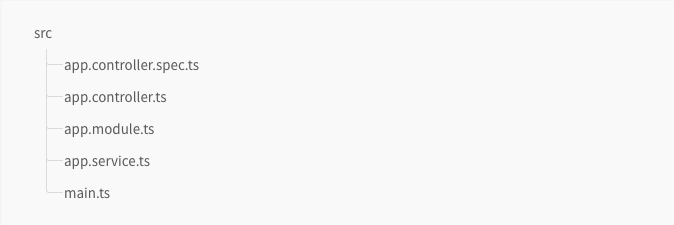
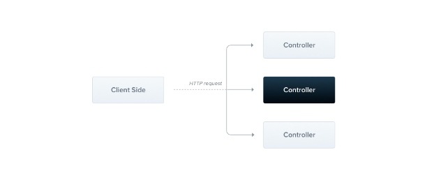
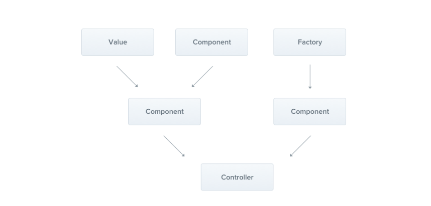
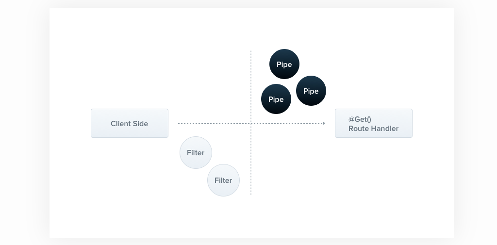
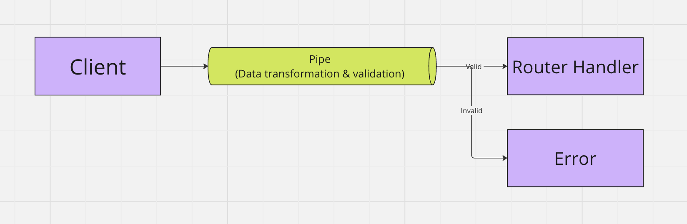
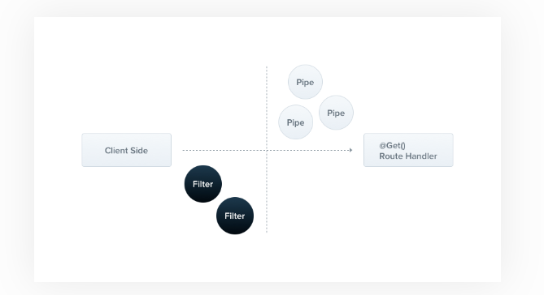

## Architecture of Nest



- app.controller.spec.ts
- app.controller.ts
- app.module.ts
- app.service.ts
- main.ts
  - The entry file of the application which uses the core function `NestFactory` to create a Nest application instance.

#### NestFactory

- exposes a few static methods that allow creating an application instance.
- `create()`: returns an application object, which fulfills the `INestApplication`

## Controllers

Controllers are responsible for handling incoming **requests** and returning **responses** to the client.



- A controller's purpose is to receive specific requests for the application.

  - The **routing** mechanism controls which controller receives which requests.
  - Frequently, each controller has more than one route, and different routes can perform different actions.
- In order to create a basic controller, we use classes and **decorators**.

  - Decorators associate classes with required metadata and enable Nest to create a routing map (tie requests to the corresponding controllers).

> For quickly creating a CRUD controller with the validation built-in, you may use the CLI's CRUD generator.
>
> `nest g resource [name]`

### Routing

In the following example we will use the `@Controller()` decorator, which is required to define a basic controller.

We will specify an optional route path prefix of `cats`.

- Using a path prefix in a `@Controller()` decorator allows us to easily group a set of related routes, and minimize repetitive code.
- For example, we may choose to group a set of routes that manage interactions with a cat entity under the route `/cats`.
- In that case, we could specify the path prefix cats in the `@Controller()` decorator so tha twe don't have to repeat that portion of the path for each route in the file.

```typescript
import { Controller, Get } from '@nestjs/common';

@Controller('cats')
export class CatsController {
  @Get()
  findAll(): string {
    return 'This action returns all cats';
  }
}
```

The `@Get()` HTTP request method decorator before the `findAll()` method tells Nest to create a handler for a specific endpoint for HTTP requests. The endpoint corresponds to the HTTP request method (GET in this case) and the route path.

What is the route path?

- The route path for a handler is determined by concatenating the (optional) prefix declared for the controller, and any path specified in the method's decorator.

  - Since we've declared a prefix for every route (`cats`), and haven't added any path information in the decorator, Nest will map `GET /cats` requests to this handler.
- As mentioned, the path includes both the optional *controller path prefix* **and** any *path string* declared in the request method decorator.

  - For example, a path prefix of `cats` combined with the decorator `@Get('breed')` would produce a route mapping for requests like `GET /cats/breed`.

In our example above, when a GET request is made to this endpoint, Nest routes the request to our user-defined `findAll()` method.

- Note that the method name we choose here is completely arbitrary.
- We obviously must declare a method to bind the route to, but Nest doesn't attach any significance to the method name chosen.

This method will return a 200 status code and the associated response, which in this case is just a string. Why does that happen?

To explain, we'll first introduce the concepts that Nest employs two different options for manipulating responses.

#### Standard (recomended)

- Using this built-in method, when a request handler returns a JavaScript object or array, it will **automatically** be serialized to JSON.
- When it returns a JavaScript primitive type (e.g., `string`, `number`, `boolean`), however, Nest will send just the value without attempting to serialize it.
- This makes response handling simple: just return the value, and Nest takes care of the rest.
- Furthermore, the response's **status code** is always 200 by default, except for POST requests which use 201.
  - We can easily change this behavior by adding the `@HttpCode(...)` decorator at a handler-level (see [Status codes](https://docs.nestjs.com/controllers#status-code)).

#### Library-specific

- We can use the library-specific (e.g., Express) [response object](https://expressjs.com/en/api.html#res), which can be injected using the `@Res()` decorator in the method handler signature (e.g., `findAll(@Res() response)`).
- With this approach, you have the ability to use the native response handling methods exposed by that object.
- For example, with Express, you can construct responses using code like `response.status(200).send()`.

> **WARNING**
>
> Nest detects when the handler is using either `@Res()` or `@Next()`, indicating you have chosen the library-specific option. If both approaches are used at the same time, the Standard approach is **automatically disabled** for this single route and will no longer work as expected. To use both approaches at the same time (for example, by injecting the response object to only set cookies/headers but still leave the rest to the framework), you must set the `passthrough` option to `true` in the `@Res({ passthrough: true })` decorator.

### Request object

Handlers often need access to the client **request** details. Nest provides access to the **request object** of the underlying platform (Express by default).

- We can access the request object by instructing Nest to inject it by adding the `@Req()` decorator to the handler's signature.

```typescript
import { Controller, Get, Req } from '@nestjs/common';
import { Request } from 'express';

@Controller('cats')
export class CatsController {
  @Get()
  findAll(@Req() request: Request): string {
    return 'This action returns all cats';
  }
}
```

| `@Request(), @Req()`      | `req`                                 |
| :-------------------------- | :-------------------------------------- |
| `@Response(), @Res()`*    | `res`                                 |
| `@Next()`                 | `next`                                |
| `@Session()`              | `req.session`                         |
| `@Param(key?: string)`    | `req.params` / `req.params[key]`    |
| `@Body(key?: string)`     | `req.body` / `req.body[key]`        |
| `@Query(key?: string)`    | `req.query` / `req.query[key]`      |
| `@Headers(name?: string)` | `req.headers` / `req.headers[name]` |
| `@Ip()`                   | `req.ip`                              |
| `@HostParam()`            | `req.hosts`                           |

> Note that when you inject either `@Res()` or `@Response()` in a method handler, you put Nest into **Library-specific mode** for that handler, and you become responsible for managing the response. When doing so, you must issue some kind of response by making a call on the `response` object (e.g., `res.json(...)` or `res.send(...)`),or the HTTP server will hang.

## Providers

Providers are a **fundamental** concept in Nest. Many of the basic Nest classes may be treated as a provider - services, repositories, factories, helpers, and so on.

- The main ides of a provider is that it can be **injected** as a dependency.
- This means objects can create various relationships with each other, and the function of "wiring up" these objects can largely be delegated to the Nest runtime system.



Controllers should handle HTTP requests and delegate more complex tasks to **providers**. Providers are plain JavaScript classes that are declared as providers in a module.

#### SOLID

### Services

Service in Nest isn't only vaild concept in Nest, but also programming in general.

Here is the example below. `CatsService` will be responsible for data storage and retrieval, and is designed to be used by the `CatsController`.

```
import { Injectable } from '@nestjs/common';

@Injectable()
export class CatsService {
  constructor() {
    this.cats = [];
  }

  create(cat) {
    this.cats.push(cat);
  }

  findAll() {
    return this.cats;
  }
}
```

Our CatsService is a basic class with one property and two methods.

- The only new feature is that it uses the  `Injectable()` decorator.
- `Injectable()` decorator: attaches metadata, which declares that `CatsService` is a class that can be managed by the **[Nest IoC container](### DI fundamentals)**.

```
import { Controller, Get, Post, Body, Bind, Dependencies } from '@nestjs/common';
import { CatsService } from './cats.service';

@Controller('cats')
@Dependencies(CatsService)
export class CatsController {
  constructor(catsService) {
    this.catsService = catsService;
  }

  @Post()
  @Bind(Body())
  async create(createCatDto) {
    this.catsService.create(createCatDto);
  }

  @Get()
  async findAll() {
    return this.catsService.findAll();
  }
}
```

The `CatsService` is injected through the class constructor.

Notice the use of the private syntax. This shorthand allows us to both declare and initialize the `catsService` member immediately in the same location.

### Dependency Injection

Nest is built around the strong design pattern commonly known as **Dependency injection. (Feat. Angular)**

- There are two main roles in the DI (Dependency Injection) system: dependency consumer and dependency provider.
  - When a dependency is requested, the injector checks its registry to see if there is an instance already available there.
  - If not, a *new instance* is created and stored in the registry.
  - Angular creates an *application-wide injector* during the application bootstrap process, as well as any other injectors as needed.
  - In most cases, you don't need to manually create injectors, but you should know that there is a layer that connects providers and consumers.

In the example below, Nest will resolve the `CatService` by creating and returning an instance of `CatService` (or returning the existing instance if it has already been requested). This dependency is resolved and passed to your controller's constructor (or assigned to the indicated property).

```
constructor(private catsService: CatsService) {}
```

### Scops

Providers normally have a lifetime (scope) synchronized with the application lifecycle.

* When the application is bootstrapped, every dependency must be resolved, and therefore every provider has to be **instantiated**.
* Similarly, when the application shuts down, each provider will be destroyed.
* However, there are ways to make your provider lifetime *request-scoped* as well.

## Pipes

A **pipe** is a class annotated with the `@Injectable()` decorator, which implements the `PipeTransform` interface.



Pipe have two typical use cases.

- **transformation**: transform input data to the desired form (e.g. from string to integer).
- **validation**: evaluate input data and if valie, simply pass it through unchanged; otherwise, throw an exception.

In both cases, pipes operate on the `arguments` being processed by a **controller, route, handler**.



- Nest interposes a pip just **before** a method is invoked, and the pipe received the arguments destined for the method and operates on them.
- Any transformation or validation operation takes place at that time, after which the route handler is invoked with any transformed arguments.

> Pipes run inside the execptions zone. This means that when a Pipe throws an exception it is handled by the exceptions layer. (global exceptions filter and any `exceptions filters` that are applied to the current context). Given the above, it should be clear that when an exception is thrown in a Pipe, **no controller method is subsequently executed.**

### Level of Pipes

Handler-level Pipes

Pameter-level Pipes

Global Pipes

### Buit-in pipes (transformation use case)

They are exported from the `@nestjs/common` package.

* `ValidationPipe`
* `ParseIntPipe`
* `ParseFloatPipe`
* `ParseBoolPipe`
* `ParseArrayPipe`
* `ParseUUIDPipe`
* `ParseEnumPipe`
* `DefaultValuePipe`
* `ParseFilePipe`

## Exception filters

Nest comes with a built-in **exceptions layer** which is responsible for processing all unhandled exceptions across an application.

- When an exception is not handled by your application code, it is caught by this layer, which then automatically sends an appropriate user-friendly response.
- This action is performed by a built-in global exception filter, which handles exceptions of type `HttpException`.
- When an exception is **unrecognized** (are neither `HttpException` nor a class that inherits from `HttpException`), the built-in exception filter generates the following default JSON reponse.

```
{
  "statusCode": 500,
  "message": "Internal server error"
}
```



### Throwing standard exceptions

Nest provides a built-in `HttpException` class, exposed from the `@nestjs/common `package. It's best practice to send standard HTTP response objects when certain error conditions occur.

Here is an example.

```typescript
@Get()
async findAll() {
  throw new HttpException('Forbidden', HttpStatus.FORBIDDEN);
}

// The response looks like this.
{
  "statusCode": 403,
  "message": "Forbidden"
}
```

The `HttpException` constructor takes two required arguments which determine the response.

- The `response` argument: defines the JSON response body. It can be a string ot an object.
- The `status` argument: defines the HTTP status code.

To override just the message portion of the JSON response body, supply a string in the `response` argument. To override the entire JSON response body, pass an object in the `response` argument. Nest will serialize the object and return it as the JSON response body.
